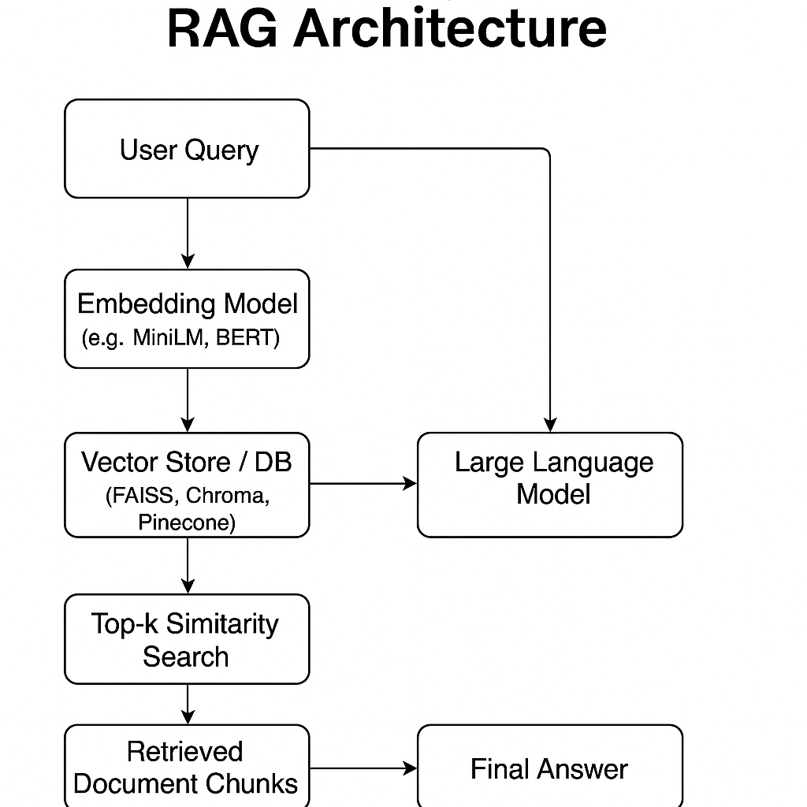

# 🧠 Mini RAG App

A simple command-line **Retrieval-Augmented Generation (RAG)** chatbot using:

- 🧩 **Claude 3 Haiku (Anthropic)**
- 🔍 **HuggingFace Embeddings**
- 🗂️ **Chroma Vector Store**
- 📄 Support for `.txt`, `.pdf`, and **web pages**

---

## 📦 Features

- Loads content from:
  - Plain text files (`.txt`)
  - PDF documents (`.pdf`)
  - Web pages (via URL)
- Splits and embeds documents using HuggingFace models
- Stores embeddings in a local vector store using Chroma
- Queries are answered using Claude via LangChain's `RetrievalQA`

---

## 🛠 Requirements

- Python 3.10 or higher
- `conda` or `venv` for virtual environments
- macOS/Linux (PDF support may need additional dependencies)

---

## 🧠 RAG Architecture Overview

The Retrieval-Augmented Generation (RAG) architecture enhances LLM responses by grounding them in relevant, up-to-date context from external documents.

---

### 📊 Architecture Diagram

---

### 🔍 Components

- **User Query**: Input question from the user.  
- **Embedding Model**: Converts query and documents into high-dimensional vectors.  
- **Vector Database** (e.g. Chroma, FAISS): Stores document embeddings and retrieves semantically similar ones using vector similarity search.  
- **Retriever**: Fetches relevant chunks from the vector DB based on similarity to the user query.  
- **LLM** (e.g. Claude, GPT): Generates a grounded answer based on retrieved context.  
- **Answer + Sources**: Final output includes the generated answer and references to source documents.  
